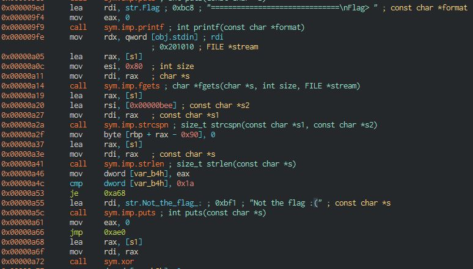
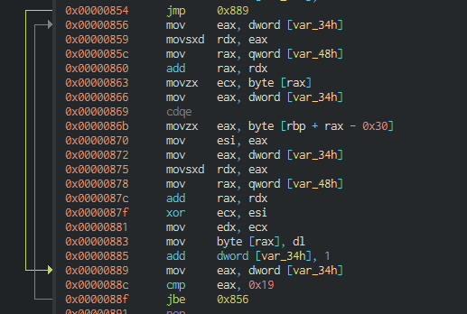
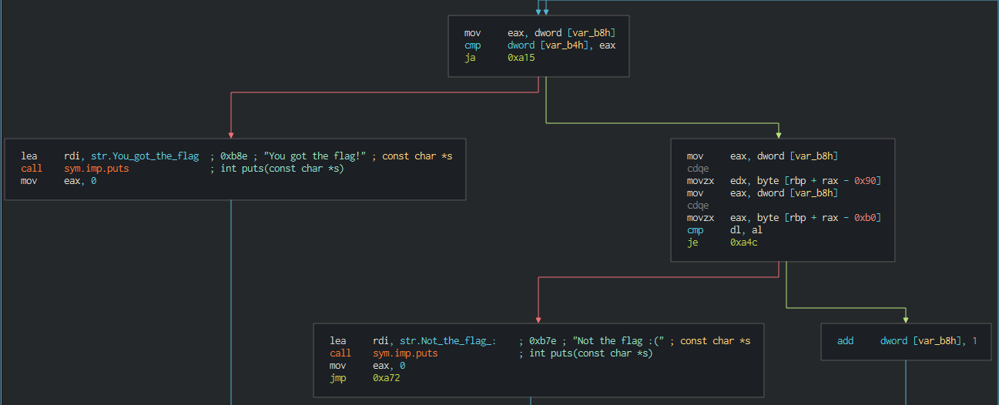
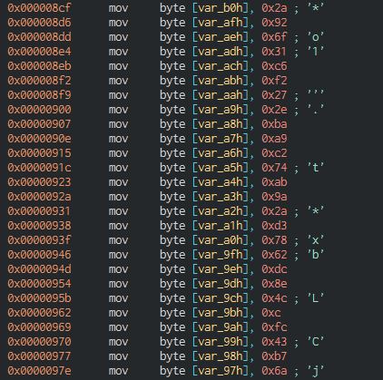
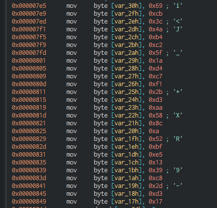

## Rox
I hate trailing characters, and this is not a reference to the roxanne tiktok meme.

## Distribution
- Rox
  - SHA1: `0a4cb39ba059b9ef10f1c1debc1cddf1b5b2d1fd`
  - ELF 64 bit binary

## Solution
When looking at the main function, we observe that the program gets user input and strips the trailing new line character. The program then checks if the input has a length of 26 characters, which means that our flag must be 26 characters.



If the input is 26 characters another function called xor is called, which basically performs a XOR bitwise operation between the user input and an array of bytes.



After XOR operation has been performed, the input values are compared with an array of bytes. If the two arrays are equal, this will indicate that we have the right flag. Hence, to obtain the flag we can XOR the array of bytes in the XOR function and the other array of bytes the program uses to compare the user input.



Flag bytes values after XOR



XOR bytes values



### Sample solution
```python
#!/usr/bin/env python3

xor_vals = [42, 146, 111, 49, 198, 242, 39, 46, 186, 169, 194, 116, 171, 154, 42, 211, 120, 98, 220, 142, 76, 12, 252, 67, 183, 106]
enc_flag = [105, 203, 60, 74, 180, 194, 95, 26, 212, 199, 241, 43, 211, 170, 88, 140, 10, 82, 191, 229, 19, 57, 200, 45, 211, 23]
flag = ""
for flag_byte,xor_byte in zip(xor_vals,enc_flag):
    flag += chr(flag_byte ^ xor_byte)
print(flag)
```
### Flag
`CYS{r0x4nn3_x0r_r0ck_54nd}`