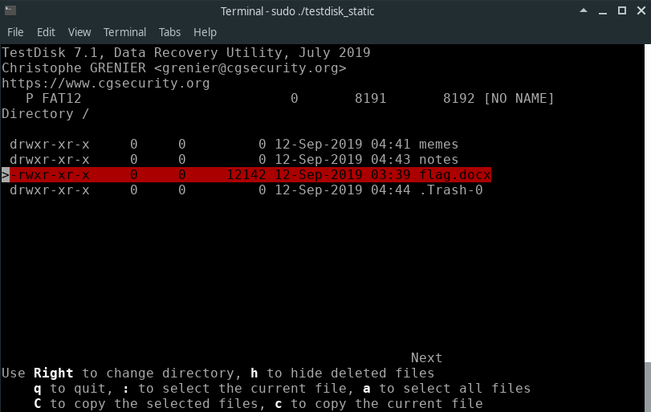
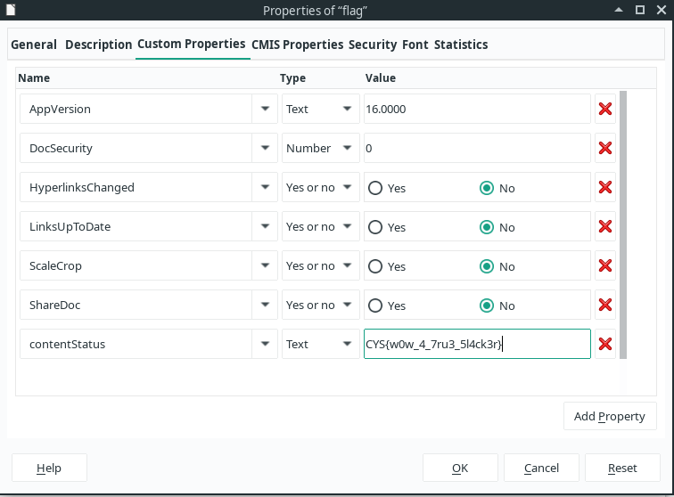

# Professional Slacker

I recently acquired a USB thumbdrive from my friend, he said that the drive contained some hidden cool tips on how to become a professional slacker. However, he accidentally deleted it before passing me the drive, help me recover the document!

## Deployment

Upload dd image to static file server.

- secret.dd
    - SHA1: `1a885adcddf60e52a7e08be19422aa57d7ad9973`
    - FAT12 

## Solution

In the FAT file system, the deleted files' data remains intact in the Data Area until it is overwritten. This area is also known as the slack space, and is a key part of forensic investigations.

1. Mount the dd image - `mount secret.dd /mnt/tmp`
2. Use forensics toolkit to examine the mounted drive and the deleted files inside - e.g: [TestDisk](https://www.cgsecurity.org/wiki/TestDisk)
3. Using TestDisk, run the `sudo ./testdisk_static`. Afterwards, `Select "No Log" > The mounted disk name > "None" > "Undelete"`

The screenshot below shows TestDisk being able to identify and determine the deleted document:

4. After extracting the deleted `flag.docx`, the flag can be found in the document properties, specifically in contentStatus property in the "Custom Properties" in LibreOffice:

Alternatively, we can also manually examine the dd image by using `binwalk -e secret.dd`. We can see that there are files present that make up a Microsoft Word document, e.g: `./docProps/, ./word/, ./_rels/, ./customXml/, ./[Content_Types].xml`. We can delete the unnecessary files and ["re-zip"](https://superuser.com/questions/411911/re-zipped-docx-files-dont-open-in-word) the remaining files to retrieve the deleted Word Document: `zip -r flag.docx`.

### Flag
`CYS{w0w_4_7ru3_5l4ck3r}`
